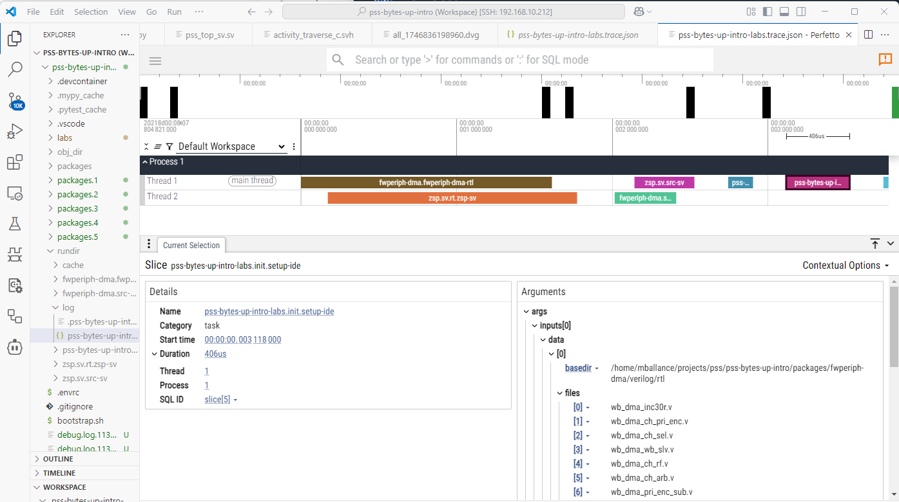

#################
Command reference
#################

.. argparse::
    :module: dv_flow.mgr.__main__
    :func: get_parser 
    :prog: dfm

Commands Overview
=================

DV Flow Manager provides several commands for working with flows:

* **run**: Execute tasks in a flow
* **show**: Display information about tasks
* **agent**: Launch AI assistants with DV Flow context
* **context**: Output project context for LLM agents
* **graph**: Generate visual task dependency graphs
* **util**: Internal utility commands

Common Options
==============

These options are available across multiple commands:

``-D NAME=VALUE``
    Override parameter values from the command line. Can be specified multiple
    times to override multiple parameters.
    
    .. code-block:: bash
    
        dfm run build -D debug=true -D optimization=O3

``-c, --config NAME``
    Select a package configuration to use. Configurations allow switching between
    different build modes, tool chains, or deployment targets.
    
    .. code-block:: bash
    
        dfm run build -c debug

``--root PATH``
    Specify the root directory for the flow. By default, dfm searches upward
    from the current directory for a flow.yaml or flow.yaml file.
    
    .. code-block:: bash
    
        dfm run build --root /path/to/project

Run Command
===========

Execute one or more tasks in a flow.

.. code-block:: bash

    dfm run [OPTIONS] [TASKS...]

If no tasks are specified, dfm lists available tasks in the package.

Run Options
-----------

``-j N``
    Set the degree of parallelism (number of concurrent tasks). Default is to
    use all available CPU cores. Use ``-j 1`` for sequential execution.
    
    .. code-block:: bash
    
        dfm run build -j 4

``--clean``
    Remove the rundir directory before starting the build. Forces a complete
    rebuild of all tasks.
    
    .. code-block:: bash
    
        dfm run build --clean

``-f, --force``
    Force all tasks to run, ignoring up-to-date checks. Unlike ``--clean``,
    this preserves the rundir but marks all tasks as needing execution.
    
    .. code-block:: bash
    
        dfm run test -f

``-v, --verbose``
    Show all tasks including those that are up-to-date. By default, only tasks
    that execute are shown.
    
    .. code-block:: bash
    
        dfm run build -v

``-u, --ui {log,progress,tui}``
    Select the console user interface style:
    
    * **log**: Plain text output (default for non-terminals)
    * **progress**: Progress bars and live updates (default for terminals)
    * **tui**: Full-screen text user interface
    
    .. code-block:: bash
    
        dfm run build -u tui

Run Examples
------------

**Build a single task:**

.. code-block:: bash

    dfm run sim-image

**Build multiple tasks:**

.. code-block:: bash

    dfm run compile test lint

**Force rebuild with 4 parallel jobs:**

.. code-block:: bash

    dfm run all --clean -j 4

**Run with debug configuration:**

.. code-block:: bash

    dfm run build -c debug -D trace=true

Show Command
============

The show command provides discovery and inspection of packages, tasks, types, and tags.
It supports both human-readable and machine-parseable (JSON) output for Agent consumption.

.. code-block:: bash

    dfm show [SUBCOMMAND] [OPTIONS]

Sub-Commands
------------

The show command supports the following sub-commands:

* **packages** - List and search available packages
* **tasks** - List and search tasks across packages
* **task <name>** - Display detailed information about a specific task
* **types** - List data types and tags
* **tags** - List tag types and their usage
* **package <name>** - Display detailed information about a package
* **project** - Display current project structure

Common Options
--------------

These options are available across most show sub-commands:

``--search KEYWORD``
    Search by keyword in name, description, and documentation fields.
    Case-insensitive substring matching.

``--regex PATTERN``
    Search by Python regex pattern in description and documentation.

``--tag TAG``
    Filter by tag. Format: ``TagType`` or ``TagType:field=value``.

``--json``
    Output in JSON format for programmatic consumption by Agents.

``-v, --verbose``
    Show additional details including full documentation and parameters.

Show Packages
-------------

List and search available packages.

.. code-block:: bash

    dfm show packages [--search KEYWORD] [--json] [-v]

Examples:

.. code-block:: bash

    # List all packages
    dfm show packages
    
    # Search for verification packages
    dfm show packages --search verification
    
    # JSON output for scripting
    dfm show packages --json

Show Tasks
----------

List and search tasks across all packages.

.. code-block:: bash

    dfm show tasks [--package PKG] [--scope SCOPE] [--search KEYWORD] [--json]

Options:

``--package PKG``
    Filter tasks to a specific package.

``--scope {root,export,local}``
    Filter tasks by visibility scope.

Examples:

.. code-block:: bash

    # List all tasks
    dfm show tasks
    
    # Search for file-related tasks
    dfm show tasks --search file
    
    # List tasks in std package
    dfm show tasks --package std

Show Task Detail
----------------

Display detailed information about a specific task.

.. code-block:: bash

    dfm show task <name> [--needs [DEPTH]] [--json] [-v]

Options:

``--needs [DEPTH]``
    Show the needs (dependency) chain for this task. Optional DEPTH limits 
    traversal levels (-1 or omitted for unlimited).

Examples:

.. code-block:: bash

    # Show task details
    dfm show task std.FileSet
    
    # Show task with full needs chain
    dfm show task myproject.build --needs
    
    # Show needs chain limited to 2 levels
    dfm show task myproject.build --needs 2
    
    # JSON output with full details
    dfm show task std.FileSet --json

Show Types
----------

List data types and tag types.

.. code-block:: bash

    dfm show types [--tags-only] [--data-items-only] [--search KEYWORD]

Options:

``--tags-only``
    Show only tag types (types deriving from std.Tag).

``--data-items-only``
    Show only data item types (types deriving from std.DataItem).

Show Tags
---------

List tag types and their usage counts.

.. code-block:: bash

    dfm show tags [--search KEYWORD] [--json]

Show Package Detail
-------------------

Display detailed information about a specific package.

.. code-block:: bash

    dfm show package <name> [--json] [-v]

Show Project
------------

Display information about the current project.

.. code-block:: bash

    dfm show project [--imports] [--configs] [--json] [-v]

Options:

``--imports``
    Show detailed import information.

``--configs``
    Show available configurations.

Legacy Mode
-----------

For backward compatibility, the following legacy invocations are supported:

.. code-block:: bash

    # List project tasks (equivalent to: dfm show tasks --package <project>)
    dfm show
    
    # Show task with dependency tree (legacy behavior)
    dfm show <task> -a

Agent Command
=============

Launch an AI assistant with DV Flow context, including skills, personas, tools, and references.

.. code-block:: bash

    dfm agent [OPTIONS] [TASKS...]

The agent command configures and launches an AI assistant (GitHub Copilot CLI, OpenAI Codex, etc.)
with project-specific context. When you specify task references, dfm evaluates those tasks and
their dependencies to collect agent resources (skills, personas, tools, references), then generates
a comprehensive system prompt for the AI assistant.

Agent Options
-------------

``-a, --assistant {copilot,codex,mock}``
    Specify which AI assistant to use. If not specified, dfm auto-detects the available
    assistant by checking for installed tools in this order: copilot, codex.
    
    .. code-block:: bash
    
        dfm agent PiratePersona --assistant copilot

``-m, --model MODEL``
    Specify the AI model to use. The format depends on the assistant:
    
    * **Copilot**: Model names like ``gpt-4``, ``gpt-3.5-turbo``
    * **Codex**: OpenAI model identifiers
    
    .. code-block:: bash
    
        dfm agent PiratePersona --model gpt-4

``--clean``
    Clean the rundir before executing tasks. Useful when you want to ensure
    fresh evaluation of all agent resource tasks.
    
    .. code-block:: bash
    
        dfm agent MyPersona --clean

``--ui {log,progress,tui}``
    Select UI mode for task execution during context building:
    
    * **log**: Plain text output
    * **progress**: Progress bars (default for terminals)
    * **tui**: Full-screen interface
    
    .. code-block:: bash
    
        dfm agent MyPersona --ui progress

``--json``
    Output the collected context as JSON instead of launching the assistant.
    Useful for debugging or integration with custom tools.
    
    .. code-block:: bash
    
        dfm agent PiratePersona --json

``--config-file FILE``
    Write the system prompt to FILE instead of launching the assistant.
    Useful for reviewing what context will be provided to the agent.
    
    .. code-block:: bash
    
        dfm agent PiratePersona --config-file context.md

Agent Resources
---------------

The agent command recognizes four types of agent resources defined in your flow:

**AgentSkill**
    A capability or knowledge domain that the agent should possess. Skills are
    typically documented in markdown files that describe commands, APIs, or 
    domain-specific knowledge.
    
    .. code-block:: yaml
    
        tasks:
        - local: SwordPlaySkill
          uses: std.AgentSkill
          desc: Playbook of sword fighting moves
          with:
            files:
            - "${{ srcdir }}/sword_skill.md"

**AgentPersona**
    A character or role that the agent should adopt. Personas can depend on
    skills to combine capabilities with personality.
    
    .. code-block:: yaml
    
        tasks:
        - local: PiratePersona
          uses: std.AgentPersona
          needs: SwordPlaySkill
          desc: |
            I'm a crusty pirate with a tankard of rum and a 
            parrot on me shoulder. If you're feeling feisty,
            I'll show you my skill at fighting

**AgentTool**
    An MCP (Model Context Protocol) server or external tool that the agent
    can invoke.
    
    .. code-block:: yaml
    
        tasks:
        - local: FileSystemTool
          uses: std.AgentTool
          desc: File system operations
          with:
            command: mcp-server-filesystem
            args: ["--root", "${{ rootdir }}"]

**AgentReference**
    Documentation or reference material that the agent should consult.
    
    .. code-block:: yaml
    
        tasks:
        - local: APIReference
          uses: std.AgentReference
          desc: Project API documentation
          with:
            files:
            - "${{ srcdir }}/api_docs.md"

Agent Examples
--------------

**Launch agent with a persona:**

.. code-block:: bash

    dfm agent PiratePersona

This evaluates the PiratePersona task and all its dependencies (like SwordPlaySkill),
generates a system prompt with the persona description and skill documentation, then
launches the configured AI assistant.

**Launch with multiple contexts:**

.. code-block:: bash

    dfm agent PiratePersona CodingSkill TestingSkill

Combines multiple personas and skills into a single agent session.

**Preview context without launching:**

.. code-block:: bash

    dfm agent PiratePersona --config-file preview.md
    cat preview.md

**Debug context collection:**

.. code-block:: bash

    dfm agent PiratePersona --json | jq

**Use specific model:**

.. code-block:: bash

    dfm agent PiratePersona --model gpt-4 --assistant copilot

**Force fresh evaluation:**

.. code-block:: bash

    dfm agent MyPersona --clean

Agent Workflow
--------------

When you run ``dfm agent``, the following steps occur:

1. **Task Resolution**: Resolve task references to task definitions
2. **Graph Building**: Build dependency graph for all referenced tasks
3. **Task Execution**: Execute tasks to evaluate agent resources
4. **Resource Collection**: Extract skills, personas, tools, and references
5. **Prompt Generation**: Generate comprehensive system prompt with:
   
   * Project information
   * Available dfm commands
   * Skill documentation
   * Persona descriptions
   * Reference materials
   * Tool configurations

6. **Assistant Launch**: Launch AI assistant with context in interactive mode

Context Command
===============

Output project context information for LLM agents.

.. code-block:: bash

    dfm context [OPTIONS]

The context command generates comprehensive information about your DV Flow Manager
project in a format optimized for consumption by AI assistants. This is useful for
providing project awareness to LLM tools.

Context Options
---------------

``--root PATH``
    Specify the root directory for the flow.

Output includes:

* Project name and description
* Package structure and imports
* Available tasks with descriptions
* Type definitions
* Configuration options

Example:

.. code-block:: bash

    dfm context

Graph Command
=============

Generate a visual representation of task dependencies.

.. code-block:: bash

    dfm graph [OPTIONS] [TASK]

The graph command creates a dependency graph in various output formats.

Graph Options
-------------

``-f, --format {dot}``
    Specify the output format. Currently supports:
    
    * **dot**: GraphViz DOT format (default)
    
    .. code-block:: bash
    
        dfm graph build -f dot

``-o, --output FILE``
    Specify the output file. Use ``-`` for stdout (default).
    
    .. code-block:: bash
    
        dfm graph build -o build_graph.dot

Graph Examples
--------------

**Generate a graph and visualize with GraphViz:**

.. code-block:: bash

    dfm graph build -o build.dot
    dot -Tpng build.dot -o build.png

**Generate and display in one command:**

.. code-block:: bash

    dfm graph build | dot -Tpng | display

UI Modes
========

DV Flow Manager provides three different console UI modes for the run command:

Log Mode
--------

Plain text output showing task execution. Best for:

* Non-interactive environments (CI/CD)
* Log file capture
* Debugging with verbose logging enabled

Output format:

.. code-block:: text

    >> [1] Task my_pkg.compile
    Compiling 10 files...
    << [1] Task my_pkg.compile (success) 2.45s

Progress Mode
-------------

Live updating progress display with progress bars. Best for:

* Interactive terminal sessions
* Monitoring long-running builds
* Parallel task visualization

Shows:

* Active tasks with progress bars
* Completed task count
* Estimated time remaining
* Real-time task status updates

TUI Mode
--------

Full-screen text user interface. Best for:

* Complex flows with many tasks
* Detailed monitoring of parallel execution
* Interactive navigation of task output

Features:

* Scrollable task list
* Task filtering and search
* Log viewing per task
* Status summaries

Select UI mode with the ``-u`` flag or let dfm auto-select based on terminal
capabilities.

Trace Output
============

DV Flow Manager generates execution traces in Google Event Trace Format,
compatible with the Perfetto trace viewer and Chrome's about:tracing.

Trace files are automatically created in the log directory as:

.. code-block:: text

    log/<root_task>.trace.json

Viewing Traces
--------------

**Using Perfetto UI** (recommended):

1. Visit https://ui.perfetto.dev/
2. Click "Open trace file"
3. Load the .trace.json file

**Using Chrome:**

1. Navigate to chrome://tracing
2. Click "Load" and select the trace file

Trace Information
-----------------

Traces include:

* Task execution timeline
* Parallel execution visualization
* Task duration and scheduling
* Dependencies and dataflow
* Execution status and results

Use traces to:

* Identify bottlenecks
* Optimize parallelism
* Debug scheduling issues
* Understand execution patterns

Output Directory Structure
==========================

DV Flow Manager creates an output directory structure that mirrors
the task graph being executed. Each top-level task has a 
directory within the run directory. Compound tasks have a nested
directory structure.

There are two top-level directory that always exist:

* cache - Stores task memento data and other cross-run artifacts
* log - Stores execution trace and log files

Each task directory contains some standard files:

* <task_name>.exec_data.json - Information about the task inputs, outputs, and executed commands.
* logfiles - Command-specific log files

Viewing Task Execution Data
===========================

After a run has completed, the `log` directory will contain a JSON-formatted execution
trace file named <root_task>.trace.json. This file is formatted in 
`Google Event Trace Format <https://docs.google.com/document/d/1CvAClvFfyA5R-PhYUmn5OOQtYMH4h6I0nSsKchNAySU/preview?tab=t.0#heading=h.yr4qxyxotyw>`_,
and can be processed by tools from the `Perfetto <https://perfetto.dev/>`_ project.

An execution is shown in the Perfetto UI below. In addition to seeing information
about how tasks executed with respect to each other, data about individual
tasks can be seen.

Common Patterns
===============

Here are some common command patterns for typical workflows:

**Quick incremental build:**

.. code-block:: bash

    dfm run

**Clean build for release:**

.. code-block:: bash

    dfm run all --clean -c release

**Debug single task:**

.. code-block:: bash

    dfm run problematic_task -f -j 1 -u log

**Monitor long build:**

.. code-block:: bash

    dfm run all -u tui

**Check what would run:**

.. code-block:: bash

    dfm show target_task -a

**Override parameters for testing:**

.. code-block:: bash

    dfm run test -D test_name=smoke -D seed=42

**Generate documentation graph:**

.. code-block:: bash

    dfm graph all -o project.dot
    dot -Tsvg project.dot -o project.svg

